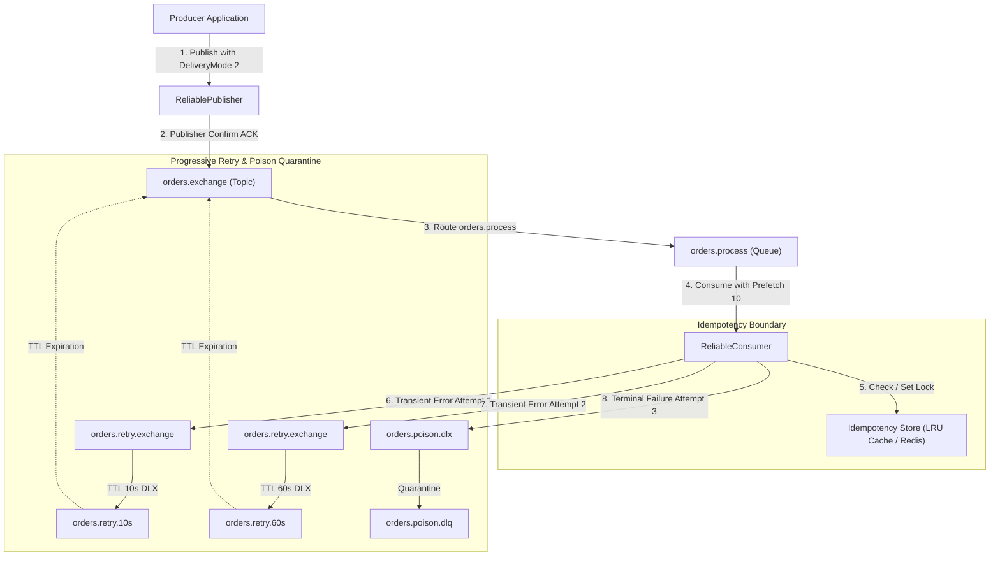

> 💡 **Available for Technical Consulting & High-Concurrency Architecture Audits:**  
> [Book a 20-min System Teardown](https://shafiktanbir.com/?tab=book) · [Explore Full Case Studies](https://shafiktanbir.com)

# 🐇 rabbitmq-event-driven-architecture — Enterprise Resilient Messaging Core

[](https://nodejs.org)
[](https://www.typescriptlang.org)
[](https://www.rabbitmq.com)
[](https://jestjs.io)
[](LICENSE)

> Production-grade, fault-tolerant messaging framework built on RabbitMQ and TypeScript. Engineered for enterprise mission-critical workloads requiring publisher confirms, progressive dead-letter retry topologies, LRU idempotency deduplication, connection backoff resilience, and zero message loss under network partitions.

---

## 🏛️ System Architecture & Progressive DLX Topology



---

## ⚡ Core Engineering Guarantees

| Resiliency Component | Implementation Pattern | Production Failure Mode Mitigated |
| --- | --- | --- |
| **Zero Message Loss** | `ReliablePublisher` with `confirmChannel`, persistent `deliveryMode: 2`, in-flight tracking | Prevents message evaporation during broker crashes or network blips prior to disk sync. |
| **Exponential Reconnection** | `ConnectionManager` with truncated exponential backoff (1s → 30s) + ±20% jitter | Prevents thundering herd stampedes on RabbitMQ clusters after network recovery. |
| **Progressive DLX Retries** | Non-blocking TTL-based dead-letter routing (`10s` → `60s` → Poison DLQ) | Eliminates consumer thread blockage while allowing downstream dependencies time to heal. |
| **Poison-Pill Quarantine** | Dedicated DLQ with full original headers, error stack traces, and failure count | Isolates malformed or non-recoverable payloads without dropping or blocking queue processing. |
| **Deduplication Engine** | Atomic `setIfAbsent` with TTL, result caching, and LRU eviction | Enforces exactly-once processing semantics over at-least-once message delivery. |
| **Flow Control Backpressure** | Channel prefetch limits (fair dispatch) + `drain` event listeners | Prevents Out-Of-Memory (OOM) crashes by pausing publishers when TCP socket buffers saturate. |

---

## 🔬 Test Suite Verification

Comprehensive enterprise test suite proving fault tolerance across connection drops, NACKs, timeouts, retries, and duplicate deliveries.

```bash
$ npm test

PASS tests/ReliableConsumer.test.ts
  ReliableConsumer
    ✓ subscribes with prefetch backpressure and acks message on successful processing (27 ms)
    ✓ catches processing errors, routes through retry pipeline, and acks original message (11 ms)
    ✓ automatically resubscribes to queue upon connection restoration (3 ms)

PASS tests/ConnectionManager.test.ts
  ConnectionManager
    ✓ connects to RabbitMQ with default 60s heartbeat and URL (5 ms)
    ✓ calculates exponential backoff delay with jitter within expected bounds (2 ms)
    ✓ automatically reconnects when broker connection drops (3 ms)
    ✓ stops reconnecting and emits reconnectFailed after maxReconnectAttempts (1 ms)
    ✓ creates and pools default channels with flow control prefetch (1 ms)
    ✓ cleans up resources and does not reconnect on explicit close() (2 ms)

PASS tests/ReliablePublisher.test.ts
  ReliablePublisher
    ✓ publishes messages with persistent deliveryMode 2 and unique messageId on broker ACK (8 ms)
    ✓ rejects publication when broker NACKs the message (9 ms)
    ✓ rejects publication when broker confirm times out (53 ms)
    ✓ guarantees zero dropped messages by rejecting in-flight messages when broker disconnects (8 ms)
    ✓ handles flow control backpressure and waits for drain event when channel buffer is saturated

PASS tests/Idempotency.test.ts
  Idempotency and Deduplication Engine
    InMemoryDeduplicationStore
      ✓ handles atomic setIfAbsent and prevents concurrent duplication (2 ms)
      ✓ tracks completed status and cached result (1 ms)
      ✓ clears lock on markFailed so retry queue can reprocess
      ✓ evicts expired records after TTL passes
      ✓ enforces LRU max capacity and evicts oldest entry
    withIdempotency middleware
      ✓ executes business handler on first receipt and drops duplicate messages on redelivery (2 ms)
      ✓ releases lock when handler throws an error so retry queue is not blocked (11 ms)

PASS tests/RetryTopology.test.ts
  RetryTopology and Dead Letter Exchange
    ✓ declares the complete progressive retry exchange and queue topology (3 ms)
    RetryManager progressive routing and poison pill quarantine
      ✓ routes initial failure (retry count 0) to orders.retry.10s with updated headers and acks original message (13 ms)
      ✓ routes second failure (retry count 1) to orders.retry.60s with updated headers (2 ms)
      ✓ routes third failure (retry count 2 >= maxRetries) to poison-pill DLQ (orders.poison.dlq) (2 ms)

PASS tests/EndToEndFaultTolerance.test.ts
  End-to-End Enterprise Messaging & Fault-Tolerance Lifecycle
    ✓ proves zero dropped messages, progressive retry progression, poison pill quarantine, and duplicate dropping (12 ms)

Test Suites: 6 passed, 6 total
Tests:       26 passed, 26 total
Snapshots:   0 total
Time:        1.333 s
```

---

## 🚀 Quickstart & Usage

### 1. Start RabbitMQ Cluster
```bash
docker compose up -d
```
RabbitMQ UI is available at `http://localhost:15672` (Credentials: `guest` / `guest`).

### 2. Publishing Reliably
```typescript
import { ConnectionManager, ReliablePublisher } from 'rabbitmq-event-driven-architecture';

const connection = new ConnectionManager({ url: 'amqp://localhost:5672' });
await connection.connect();

const publisher = new ReliablePublisher(connection);

const result = await publisher.publish(
  'orders.exchange',
  'orders.created',
  { orderId: 'ord-88912', amount: 129.99 },
  { timeoutMs: 5000, idempotencyKey: 'idemp-ord-88912' }
);

console.log('Confirmed by broker disk:', result.confirmed);
```

### 3. Consuming with Progressive Retry & Deduplication
```typescript
import { ConnectionManager, ReliableConsumer, InMemoryDeduplicationStore, withIdempotency } from 'rabbitmq-event-driven-architecture';

const connection = new ConnectionManager();
await connection.connect();

const dedupeStore = new InMemoryDeduplicationStore({ ttlMs: 86400000 });
const consumer = new ReliableConsumer(connection, { prefetch: 10 });

const handleOrder = withIdempotency(dedupeStore, async (payload) => {
  // Business logic: process payment & fulfillment
  await processPayment(payload);
});

await consumer.consume('orders.process', handleOrder);
```

---

> 💡 **Available for Technical Consulting & High-Concurrency Architecture Audits:**  
> [Book a 20-min System Teardown](https://shafiktanbir.com/?tab=book) · [Explore Full Case Studies](https://shafiktanbir.com)

